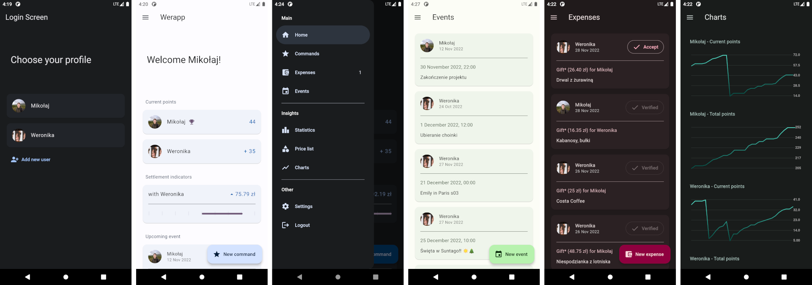
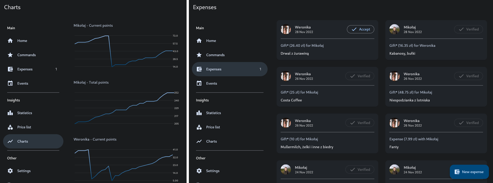

# Werapp

Flutter application frontend for a game I came up with my girlfriend.

The project has grown to be more than just about the game and also includes a way to settle expenses and option to add future events.

## The game

Rules of the game are simple. Every time someone is nice to you, did something good or some other meritorious thing, you give them a point.
Once you have enough points, you can spend them on a command for the other user.

## Application

App screenshots in light / dark mode with different color themes.

Preview of the app displayed on larger screens.

## Server backend

This app needs a server backend to function, which at this time is not ready to be published yet. The [OpenAPI](https://swagger.io/specification/) specification that this app uses is available in the [backend.yaml](backend.yaml) file.

## Notifications

This app uses [Firebase Cloud Messaging](https://firebase.google.com/docs/cloud-messaging/) for notification delivery. Every time other users do something in the app that is related to you, you will receive a notification.

In the project files there are multiple firebase configuration files.

These can be manually filled (remove `.themplate` file extension) or generated using the `flutterfire configure` command in this [documentation](https://firebase.google.com/docs/flutter/setup?platform=android).

## License

This project is licensed under GNU General Public License. Please see the [licence file](LICENSE) for more information.
